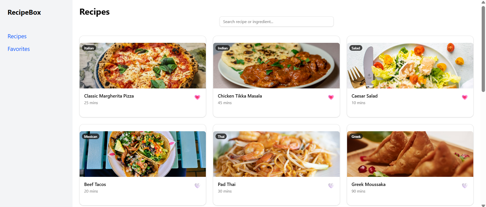
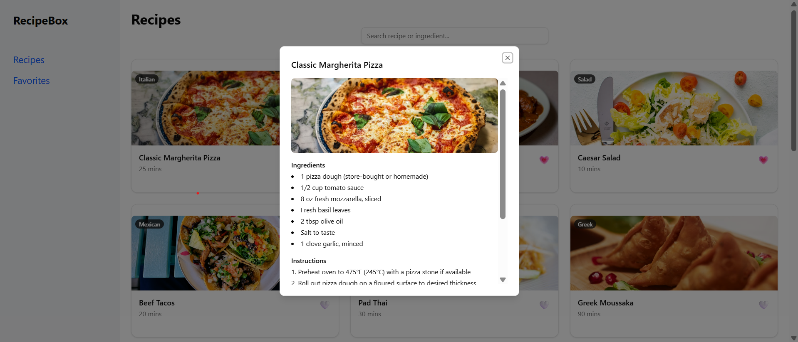
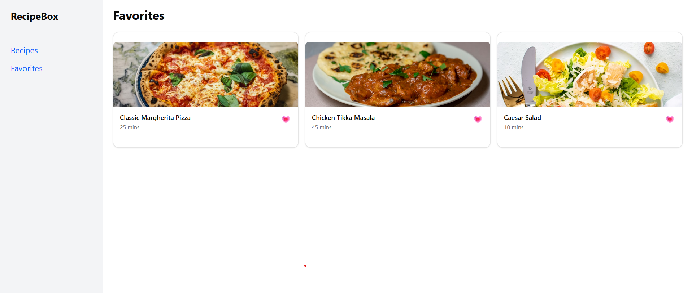

# Recipe SPA

## Project Description
RecipeBox is a single-page application (SPA) built with React.js. The app displays a list of recipes, allows users to view recipe details, search by title or ingredient, and mark recipes as favorites. The project demonstrates basic SPA functionality, component usage, and routing with React Router.

## Features
- Display a list/grid of recipes
- View full recipe details
- Search recipes by title or ingredient
- Mark recipes as favorites

## Setup / Installation

1. **Clone the repository**  
```bash
git clone <your-repo-url>
cd <your-repo-folder>
```

2. **Install dependencies**
```bash
npm install
```  

2. **Start the development server**
```bash
npm start
```  

The app will run at http://localhost:5173/ by default.

## Dependencies
- React.js  
- React Router  
- ShadCN UI  

### ShadCN UI Components Used
- Card  
- Dialog  
- Input  

## Data Source
The app uses `recipes.json` as its data source. Data is fetched when the components mount to display recipes dynamically.

## Application Screenshots





